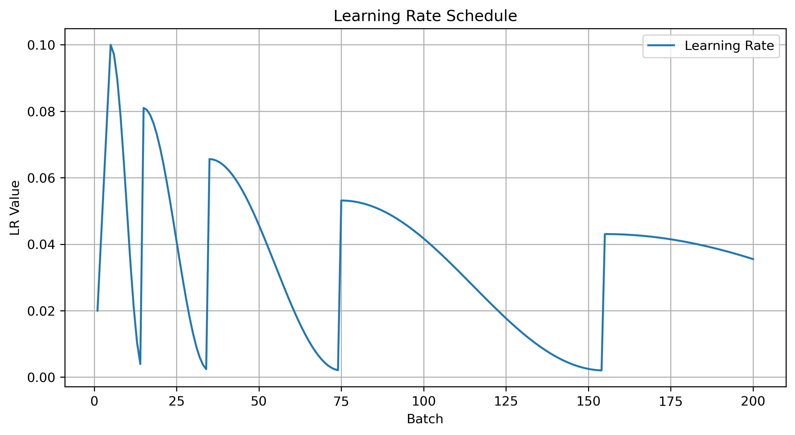

<p align="center"> 
 <h1 align="center">Combine Linear Warmup with CosineAnnealingWarmRestarts and Learning Rate Decay.</h1>
</p>

## Parameters
- `optimizer (Optimizer):` any optimizer from torch.optim library
- `T_0: (int):` First cycle step size, Number of iterations for the first restart. Default: 10.
- `T_mul (int, optional)`: A factor by which T_i increases after a restart. Default: 1.
- `eta_min(int, optional):` Minimum learning rate. Default: 0.
- `step_per_epoch(int):` Number of batches per epoch.
- `max_lr (float):` warmup's max learning rate. Default: 0.1.
- `warmup_steps (int):` Linear warmup step size. Default: 0. Number of iterations required to reach max_lr
- `gamma (float):` decay factor values between 0-1 between (1.0 no decay). Default: 0.9.
- `last_epoch (int):` The index of last epoch.
## How to use 
You can easily implement it in your code, for example:
```python3
scheduler = CombinedWarmupCosineScheduler(
        optimizer,
        warmup_epochs=5,
        max_lr=0.1,
        T_0=10,
        T_mult=2,
        eta_min=0.002,
        step_per_epoch=10,
        gamma=0.9
    )
```
Remember that Step could be called after every batch update.
```python3
 for epoch in range(epochs):
        for batch in range(step_per_epoch):
            optimizer.step()
            scheduler.step()
```
## Results
This table shows the learning rate values for each batch after running the command above
<p align="center">
  
</p>
